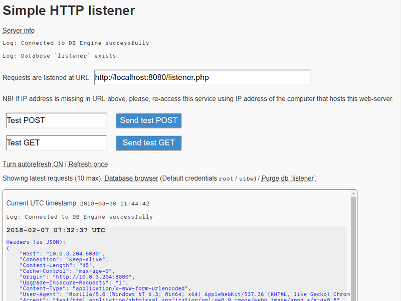

# Simple Web Requests Listener

Test integrations over HTTP using local standalone WAMP web-server.

<!-- START doctoc generated TOC please keep comment here to allow auto update -->
<!-- DON'T EDIT THIS SECTION, INSTEAD RE-RUN doctoc TO UPDATE -->
**Table of Contents**  

- [Codebase Structure](#codebase-structure)
- [Installation](#installation)
- [Typical Use Scenario](#typical-use-scenario)

<!-- END doctoc generated TOC please keep comment here to allow auto update -->

## Codebase Structure

 * `img/` - contains illustrations, not required to run the service
 * `php-listener/` - common features
   - `db-*.php` - database management
   - `time-tz-reset.php` - set timezone to UTC
 * `root/` - front end entry points
   - `index.php` - user entry point
   - `index-dflt.php` - web server info (`phpinfo`)
   - `listener.php` - request listener entry point
   - `monitor.php` - stored requests logger
 * `settings/php.ini` - adjusted settings for `php`

The only difference in `settings/php.ini` against the one from
web server distribution is that customized `ini` sets
`always_populate_raw_post_data` to `On`.

[TOC :arrow_double_up: ](#table-of-contents)  

## Installation

Install any AMP (Apache+MySQL+PHP) web server.

The project is structured to fit portable standalone [UsbWebServer](usbwebserver.com).
However the codebase can be mapped upon any other AMP server.

Mapping rules:
 * `root/` contents `=>` web server doc root
 * `php-listener/` should be located at the same level as the doc root folder
 * `php.ini`: set `always_populate_raw_post_data` property to `On`

Launch the web server (e.g. run `usbwebserver.exe`).

Grant Apache and MySQL whatever permissions your OS requires.

Navigate to [localhost](localhost), [localhost:8080](localhost:8080) or other
port as your web server instance requires (e.g. click `Localhost` button in
UsbWebServer UI).

You will want to see the following:

Should you require to log requests across your local network
make sure your web server is accessible from within your local network:
 1. Replace `localhost` with web server host IP address and reload
 2. Try accessing your web server instance from any different device

Should you face any issues adjust your network infrastructure settings (firewalls,
port forwarding etc.) 

[TOC :arrow_double_up: ](#table-of-contents)  

## Typical Use Scenario

Click 'Send test POST' and/or 'Send test GET'. You will see requests logged in
the monitoring box. The monitoring box refreshes every 500ms.

Copy URL from the input field labeled `Requests are listened at URL` and
use it to send requests.

Watch requests as they arrive from senders.

Note that multi-part POST request parts are stored to files under `./root/post-files/`
and on-screen log contains files information rather than parts' content. 

[TOC :arrow_double_up: ](#table-of-contents)
